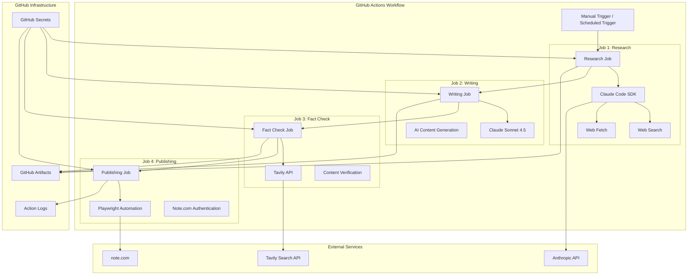

# Design Document

## Overview

Note Automation Systemは、GitHub Actionsを基盤としたnote記事の完全自動化システムです。ユーザーが指定したテーマに基づいて、Web検索によるリサーチ、AI記事執筆、ファクトチェック、そしてnote.comへの自動投稿までを一連のワークフローとして実行します。システムは4つの独立したJobで構成され、各Jobが前のJobの結果を受け取って処理を進める設計となっています。

## Architecture

### System Architecture



### Technology Stack

**Workflow Orchestration:**
- GitHub Actions (YAML-based workflow definition)
- Node.js 20+ runtime environment
- GitHub Artifacts for inter-job data transfer
- GitHub Secrets for secure credential management

**AI and Research Services:**
- Claude Code SDK (Web search and content fetching)
- Claude Sonnet 4.5 (Content generation)
- Tavily API (Fact-checking and verification)
- Anthropic API (AI model access)

**Web Automation:**
- Playwright (Browser automation for note.com)
- Chromium browser engine
- Storage State management for authentication

**Data Processing:**
- JSON for structured data exchange
- Markdown for content formatting
- File system for temporary storage

## Components and Interfaces

### 1. Workflow Trigger Interface

```yaml
# GitHub Actions Workflow Input Schema
inputs:
  theme:
    description: '記事のテーマ'
    required: true
    type: string
  target:
    description: '想定読者'
    required: true
    type: string
  message:
    description: '伝えたい核メッセージ'
    required: true
    type: string
  cta:
    description: '読後のアクション'
    required: true
    type: string
  tags:
    description: 'カンマ区切りのタグ'
    required: true
    type: string
  is_public:
    description: '公開設定 (true: 公開, false: 下書き)'
    required: true
    type: boolean
    default: false
  dry_run:
    description: 'テスト実行 (true: 投稿スキップ, false: 実際に投稿)'
    required: true
    type: boolean
    default: true
```

### 2. Research Job Interface

```typescript
interface ResearchJobInput {
  theme: string
  target: string
  message: string
}

interface ResearchJobOutput {
  researchReport: ResearchReport
  sources: Source[]
  keywords: string[]
  timestamp: string
}

interface ResearchReport {
  topic: string
  summary: string
  keyPoints: KeyPoint[]
  trends: Trend[]
  statistics: Statistic[]
  expertOpinions: ExpertOpinion[]
}

interface Source {
  url: string
  title: string
  content: string
  relevanceScore: number
  credibilityScore: number
  publishDate?: string
}

interface ClaudeCodeSDKConfig {
  tools: ['web_search', 'web_fetch']
  searchQueries: string[]
  maxResults: number
  timeout: number
}
```

### 3. Writing Job Interface

```typescript
interface WritingJobInput {
  researchReport: ResearchReport
  theme: string
  target: string
  message: string
  cta: string
  tags: string[]
}

interface WritingJobOutput {
  article: Article
  metadata: ArticleMetadata
  generationStats: GenerationStats
}

interface Article {
  title: string
  content: string
  tags: string[]
  estimatedReadingTime: number
  wordCount: number
}

interface ArticleMetadata {
  generatedAt: string
  model: string
  promptVersion: string
  contentStructure: ContentStructure
}

interface ClaudeSonnetConfig {
  model: 'claude-3-5-sonnet-20241022'
  maxTokens: number
  temperature: number
  systemPrompt: string
  userPrompt: string
}
```

### 4. Fact Check Job Interface

```typescript
interface FactCheckJobInput {
  article: Article
  researchReport: ResearchReport
}

interface FactCheckJobOutput {
  verifiedArticle: Article
  factCheckReport: FactCheckReport
  corrections: Correction[]
}

interface FactCheckReport {
  overallScore: number
  checkedClaims: CheckedClaim[]
  verificationSources: Source[]
  confidence: number
}

interface CheckedClaim {
  claim: string
  verification: 'verified' | 'disputed' | 'unverifiable'
  sources: Source[]
  confidence: number
  correction?: string
}

interface TavilyAPIConfig {
  searchDepth: 'basic' | 'advanced'
  includeAnswer: boolean
  includeRawContent: boolean
  maxResults: number
}
```

### 5. Publishing Job Interface

```typescript
interface PublishingJobInput {
  verifiedArticle: Article
  isPublic: boolean
  dryRun: boolean
}

interface PublishingJobOutput {
  publishResult: PublishResult
  noteUrl?: string
  screenshots: string[]
}

interface PublishResult {
  success: boolean
  status: 'published' | 'draft' | 'failed' | 'skipped'
  message: string
  timestamp: string
}

interface PlaywrightConfig {
  browser: 'chromium'
  headless: boolean
  timeout: number
  storageState: string
  viewport: { width: number; height: number }
}

interface NoteAutomation {
  login(): Promise<void>
  createArticle(article: Article): Promise<string>
  publishArticle(articleId: string, isPublic: boolean): Promise<void>
  takeScreenshot(step: string): Promise<string>
}
```

## Data Models

### Workflow Data Models

```typescript
interface WorkflowContext {
  runId: string
  triggeredBy: string
  triggeredAt: string
  inputs: WorkflowInputs
  environment: 'production' | 'staging' | 'development'
}

interface WorkflowInputs {
  theme: string
  target: string
  message: string
  cta: string
  tags: string[]
  isPublic: boolean
  dryRun: boolean
}

interface JobArtifact {
  jobName: string
  artifactName: string
  data: any
  createdAt: string
  size: number
}
```

### Content Models

```typescript
interface ContentStructure {
  introduction: string
  mainSections: ContentSection[]
  conclusion: string
  callToAction: string
}

interface ContentSection {
  heading: string
  content: string
  subsections?: ContentSubsection[]
  supportingData?: SupportingData[]
}

interface SupportingData {
  type: 'statistic' | 'quote' | 'example' | 'reference'
  content: string
  source?: Source
}
```

### Authentication Models

```typescript
interface StorageState {
  cookies: Cookie[]
  origins: Origin[]
}

interface Cookie {
  name: string
  value: string
  domain: string
  path: string
  expires: number
  httpOnly: boolean
  secure: boolean
  sameSite: 'Strict' | 'Lax' | 'None'
}

interface AuthenticationManager {
  loadStorageState(): Promise<StorageState>
  validateAuthentication(): Promise<boolean>
  refreshAuthentication(): Promise<void>
}
```

## Error Handling

### Job-Level Error Handling

```typescript
interface JobError {
  jobName: string
  errorType: 'api_error' | 'network_error' | 'authentication_error' | 'validation_error' | 'timeout_error'
  message: string
  details: any
  timestamp: string
  retryable: boolean
}

class WorkflowErrorHandler {
  handleJobError(error: JobError): Promise<JobResult> {
    switch (error.errorType) {
      case 'api_error':
        return this.handleAPIError(error)
      case 'network_error':
        return this.retryWithBackoff(error)
      case 'authentication_error':
        return this.handleAuthError(error)
      case 'timeout_error':
        return this.handleTimeout(error)
      default:
        throw error
    }
  }
  
  private async handleAPIError(error: JobError): Promise<JobResult> {
    // API rate limiting, quota exceeded, etc.
    if (error.details.statusCode === 429) {
      await this.waitForRateLimit()
      return this.retryJob(error.jobName)
    }
    throw error
  }
  
  private async handleAuthError(error: JobError): Promise<JobResult> {
    // Storage state expired, credentials invalid, etc.
    throw new Error(`Authentication failed: ${error.message}. Please update credentials.`)
  }
}
```

### Service-Specific Error Handling

```typescript
interface AnthropicErrorHandler {
  handleRateLimit(error: any): Promise<void>
  handleQuotaExceeded(error: any): Promise<never>
  handleModelUnavailable(error: any): Promise<void>
}

interface TavilyErrorHandler {
  handleSearchLimit(error: any): Promise<void>
  handleInvalidQuery(error: any): Promise<void>
}

interface PlaywrightErrorHandler {
  handleNavigationTimeout(error: any): Promise<void>
  handleElementNotFound(error: any): Promise<void>
  handleAuthenticationFailure(error: any): Promise<never>
}
```

## Testing Strategy

### Workflow Testing

```typescript
interface WorkflowTest {
  testWorkflowTrigger(): Promise<void>
  testJobSequence(): Promise<void>
  testArtifactPassing(): Promise<void>
  testErrorHandling(): Promise<void>
}

// GitHub Actions Local Testing
class LocalWorkflowTester {
  async runWorkflowLocally(inputs: WorkflowInputs): Promise<WorkflowResult> {
    // Use act or similar tool to test GitHub Actions locally
  }
  
  async mockExternalServices(): Promise<void> {
    // Mock Anthropic API, Tavily API, note.com
  }
}
```

### Job Testing

```typescript
interface JobTester {
  testResearchJob(mockInputs: ResearchJobInput): Promise<ResearchJobOutput>
  testWritingJob(mockInputs: WritingJobInput): Promise<WritingJobOutput>
  testFactCheckJob(mockInputs: FactCheckJobInput): Promise<FactCheckJobOutput>
  testPublishingJob(mockInputs: PublishingJobInput): Promise<PublishingJobOutput>
}

// Unit Tests for Individual Jobs
describe('Research Job', () => {
  it('should generate comprehensive research report', async () => {
    const mockInput = { theme: 'AI automation', target: 'developers', message: 'productivity' }
    const result = await researchJob.execute(mockInput)
    expect(result.researchReport.keyPoints).toHaveLength.greaterThan(3)
  })
})
```

### Integration Testing

```typescript
interface IntegrationTest {
  testEndToEndWorkflow(): Promise<void>
  testExternalAPIIntegration(): Promise<void>
  testAuthenticationFlow(): Promise<void>
}

// End-to-End Testing
class E2EWorkflowTester {
  async testCompleteWorkflow(): Promise<void> {
    // Test complete workflow from trigger to publication
    const result = await this.triggerWorkflow({
      theme: 'Test Article',
      target: 'Test Audience',
      message: 'Test Message',
      cta: 'Test CTA',
      tags: ['test'],
      isPublic: false,
      dryRun: true
    })
    
    expect(result.success).toBe(true)
    expect(result.article).toBeDefined()
  }
}
```

## Security Considerations

### Credential Management

```typescript
interface SecretManager {
  getAnthropicAPIKey(): string
  getTavilyAPIKey(): string
  getNoteStorageState(): StorageState
  validateSecrets(): Promise<boolean>
}

// GitHub Secrets Security
class GitHubSecretsManager implements SecretManager {
  getAnthropicAPIKey(): string {
    const key = process.env.ANTHROPIC_API_KEY
    if (!key) throw new Error('ANTHROPIC_API_KEY not found in secrets')
    return key
  }
  
  // Never log secrets or expose them in error messages
  private sanitizeError(error: Error): Error {
    const sanitized = error.message.replace(/sk-[a-zA-Z0-9]+/g, '[REDACTED]')
    return new Error(sanitized)
  }
}
```

### API Security

- Rate limiting compliance for all external APIs
- Secure token handling and rotation
- Request/response logging without sensitive data
- HTTPS-only communication
- Input validation and sanitization

### note.com Authentication Security

```typescript
interface NoteAuthSecurity {
  validateStorageState(state: StorageState): boolean
  detectAuthenticationExpiry(): Promise<boolean>
  securelyStoreCredentials(state: StorageState): void
  rotateAuthenticationTokens(): Promise<void>
}

// Storage State Security
class SecureStorageStateManager {
  validateStorageState(state: StorageState): boolean {
    // Validate cookie expiry, domain restrictions, etc.
    return state.cookies.every(cookie => 
      cookie.expires > Date.now() && 
      cookie.domain.includes('note.com')
    )
  }
  
  async refreshIfNeeded(): Promise<void> {
    if (!await this.validateAuthentication()) {
      throw new Error('Storage state expired. Please regenerate note-state.json')
    }
  }
}
```

## Performance Optimization

### Workflow Performance

```typescript
interface PerformanceOptimizer {
  optimizeJobExecution(): Promise<void>
  parallelizeIndependentTasks(): Promise<void>
  cacheIntermediateResults(): Promise<void>
  monitorResourceUsage(): Promise<ResourceUsage>
}

// GitHub Actions Performance
class WorkflowPerformanceManager {
  async optimizeArtifactSize(data: any): Promise<string> {
    // Compress artifacts to reduce transfer time
    return JSON.stringify(data, null, 0) // Minified JSON
  }
  
  async parallelizeWhenPossible(): Promise<void> {
    // Use GitHub Actions matrix strategy for parallel execution
    // when processing multiple articles or variations
  }
}
```

### API Performance

```typescript
interface APIPerformanceManager {
  batchAPIRequests(): Promise<void>
  implementRetryWithBackoff(): Promise<void>
  cacheAPIResponses(): Promise<void>
  monitorAPIUsage(): Promise<APIUsageStats>
}

// Rate Limiting and Optimization
class AnthropicAPIManager {
  private rateLimiter = new RateLimiter(50, 60000) // 50 requests per minute
  
  async makeRequest(prompt: string): Promise<string> {
    await this.rateLimiter.wait()
    return await this.anthropicClient.messages.create({
      model: 'claude-3-5-sonnet-20241022',
      max_tokens: 4000,
      messages: [{ role: 'user', content: prompt }]
    })
  }
}
```

## Integration Points

### GitHub Actions Integration

```yaml
# Workflow Definition Structure
name: Note Automation Workflow
on:
  workflow_dispatch:
    inputs:
      # Input definitions
  schedule:
    - cron: '0 9 * * *' # Daily at 9 AM

jobs:
  research:
    runs-on: ubuntu-latest
    outputs:
      research-report: ${{ steps.research.outputs.report }}
    steps:
      - uses: actions/checkout@v4
      - name: Setup Node.js
        uses: actions/setup-node@v4
        with:
          node-version: '20'
      - name: Run Research
        id: research
        run: node research-job.js
        env:
          ANTHROPIC_API_KEY: ${{ secrets.ANTHROPIC_API_KEY }}
```

### External Service Integration

```typescript
interface ExternalServiceIntegrator {
  integrateAnthropicAPI(): Promise<void>
  integrateTavilyAPI(): Promise<void>
  integrateNoteWebsite(): Promise<void>
  handleServiceDowntime(): Promise<void>
}

// Service Health Monitoring
class ServiceHealthMonitor {
  async checkServiceHealth(): Promise<ServiceStatus[]> {
    return await Promise.all([
      this.checkAnthropicHealth(),
      this.checkTavilyHealth(),
      this.checkNoteHealth()
    ])
  }
  
  async handleServiceFailure(service: string): Promise<void> {
    // Implement fallback strategies or graceful degradation
  }
}
```

### Monitoring and Logging

```typescript
interface WorkflowMonitor {
  logJobProgress(jobName: string, progress: number): void
  trackAPIUsage(service: string, usage: APIUsage): void
  alertOnFailures(error: JobError): Promise<void>
  generateUsageReports(): Promise<UsageReport>
}

// Comprehensive Logging
class WorkflowLogger {
  logJobStart(jobName: string, inputs: any): void {
    console.log(`[${new Date().toISOString()}] Starting ${jobName}`)
    console.log(`Inputs: ${JSON.stringify(inputs, null, 2)}`)
  }
  
  logJobComplete(jobName: string, outputs: any): void {
    console.log(`[${new Date().toISOString()}] Completed ${jobName}`)
    console.log(`Outputs: ${JSON.stringify(outputs, null, 2)}`)
  }
  
  logError(error: JobError): void {
    console.error(`[${new Date().toISOString()}] Error in ${error.jobName}:`)
    console.error(`Type: ${error.errorType}`)
    console.error(`Message: ${error.message}`)
    console.error(`Details: ${JSON.stringify(error.details, null, 2)}`)
  }
}
```